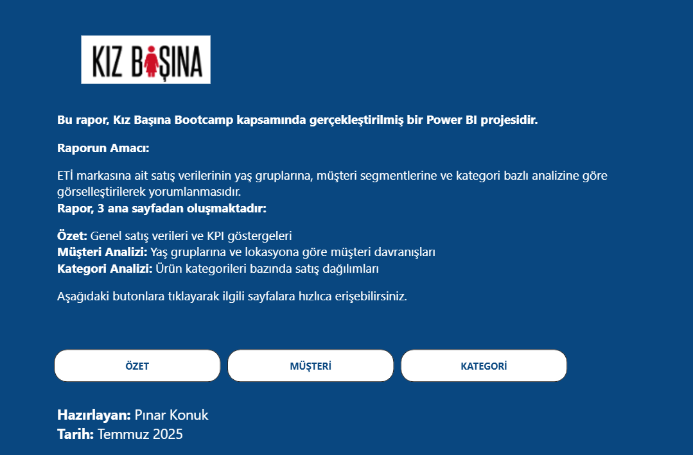
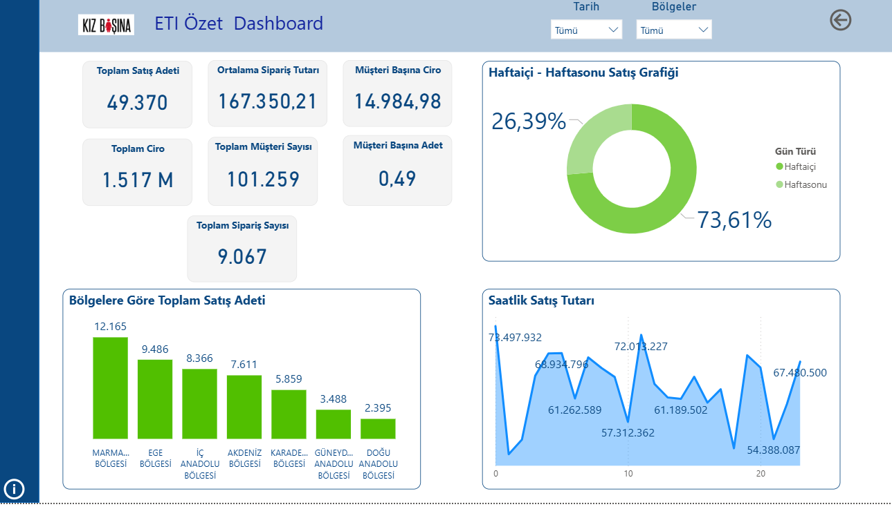
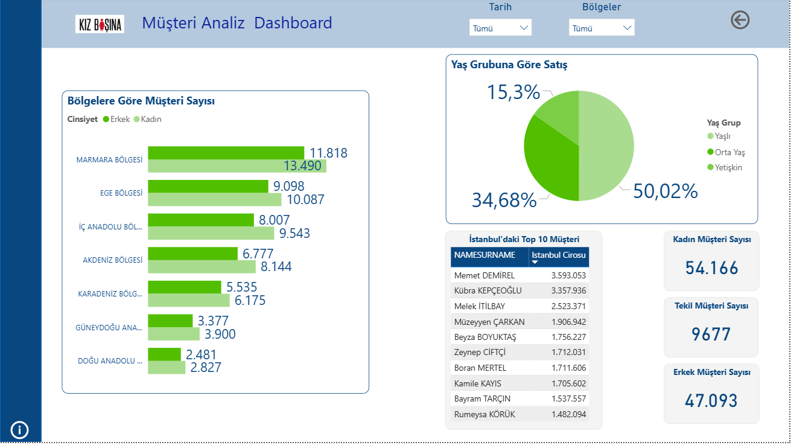
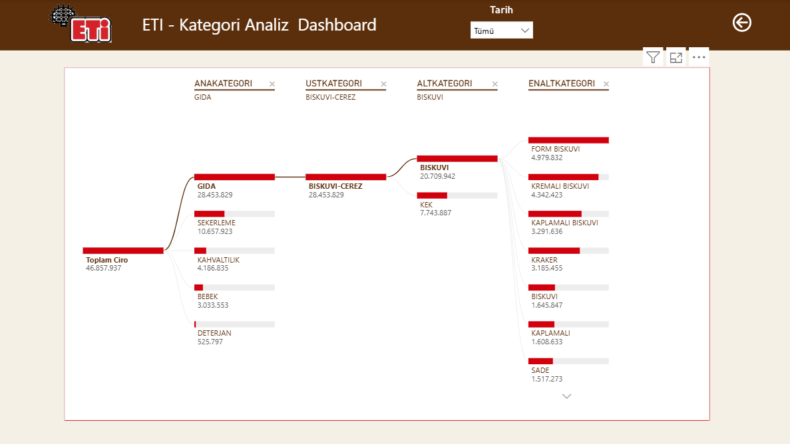
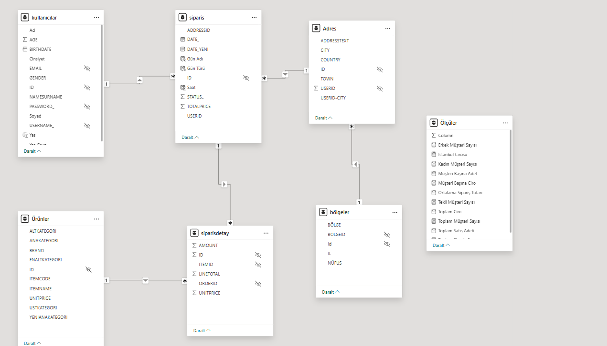

# POWER-BI Raporu

📊 ETİ Satış Analizi Power BI Projesi
Bu proje, Kız Başına Bootcamp kapsamında gerçekleştirilmiş bir Power BI raporudur. Amaç, ETİ markasına ait satış verilerini farklı açılardan analiz ederek anlamlı görselleştirmeler üretmek ve iş zekâsı becerilerini geliştirmektir.

📌 Raporun Amacı
ETİ markasına ait satış verilerinin yaş gruplarına, müşteri segmentlerine ve kategori bazlı analizine göre görselleştirilerek yorumlanmasıdır.
Giriş ekranı üzerinden kullanıcı aşağıdaki sayfalara butonlarla yönlendirilebilir:

- Özet
- Müşteri
- Kategori
Görsel öğeler (logolar, şekiller) Power BI içindeki Şekil, Düğme, Metin Kutusu ve Eylem özellikleriyle tasarlanmıştır.

🧭 Rapor 3 Ana Sayfadan Oluşmaktadır:
1. Özet Sayfası
- Toplam Satış Adeti
- Ortalama Sipariş Tutarı
- Toplam Ciro
- Toplam Müşteri Sayısı
- Müşteri Başına Ciro ve Adet
- Haftaiçi-Haftasonu Satış Dağılımı (Donut Grafik)
- Saatlik Satış Tutarı (Çizgi Grafiği)
- Bölgelere Göre Toplam Satış Adeti (Çubuk Grafik)

  

2. Müşteri Analizi Sayfası
- Bölgelere Göre Müşteri Sayısı (Kadın-Erkek Ayrımı ile)
- Yaş Grubuna Göre Satış Dağılımı (Pasta Grafik)
- İstanbul’daki Top 10 Müşteri Tablosu
- Kadın / Erkek / Tekil Müşteri Sayıları (Kartlar)

  

3. Kategori Analizi Sayfası
İstanbul’da yaşayan ve Genç Yaş Grubu (0–20) içinde yer alan müşterilerin toplam cirosunun Ana → Üst → Alt → En Alt Kategori bazlı gösterimi (Ayrıştırma Ağacı / Ağaç Haritası)

📁 Kullanılan Veriler ve Modelleme

- Users (Kullanıcılar): Yaş, cinsiyet, isim/soyisim ayrımı, şifre gizleme, yaş grubu sınıflandırması
- Adres: Şehir bilgisi ve kullanıcıyla eşleştirme
- Items (Ürünler): Kategori hiyerarşisi ve yeni sınıflandırmalar
- Sipariş ve Sipariş Detayı: Zaman bazlı analizler, tutar hesaplamaları
- Bölgeler: Şehir-bölge eşleştirmesi için dış veri seti

🛠 Modelleme Power BI içindeki ilişkiler üzerinden oluşturulmuş, gereksiz kolonlar gizlenmiştir.

🔗 Dosya Boyutu Sorunu
.pbix dosyası 25 MB sınırını geçtiği için doğrudan GitHub'a yüklenememiştir. Bunun yerine dosya Google Drive’a yüklenmiş ve bağlantısı aşağıda paylaşılmıştır:

📂 ETİ Power BI Raporu 
https://drive.google.com/file/d/1md7EJGx3yJiTwIoynE3kGZAvry1H1WbG/view?usp=drive_link
